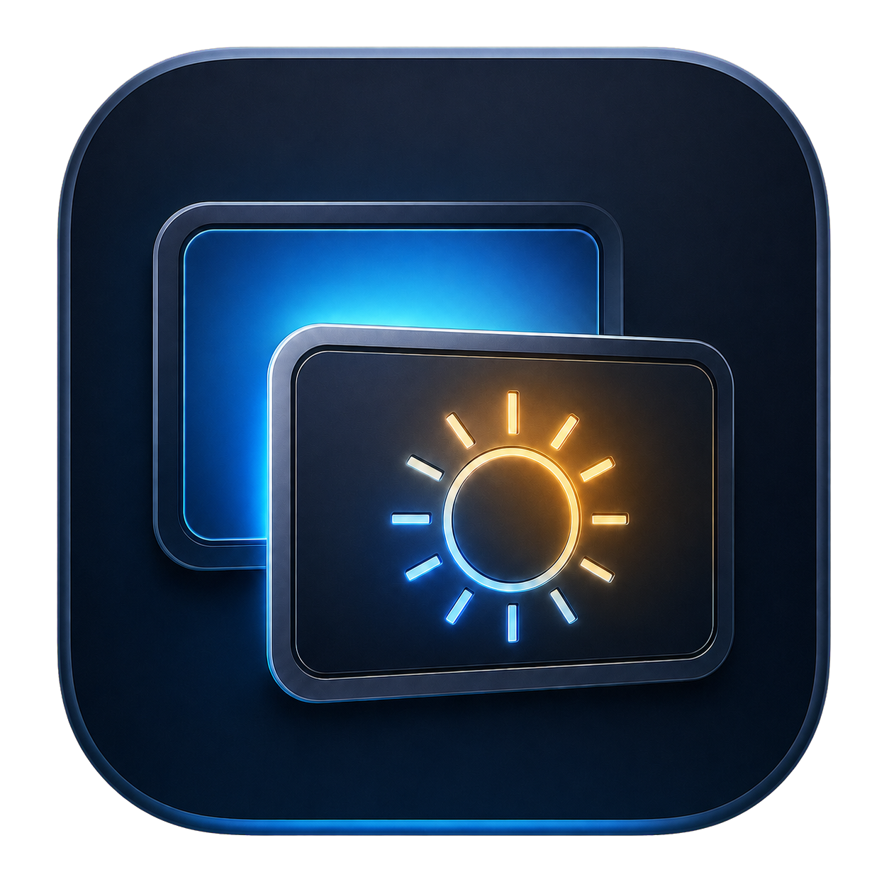

# LumaDeck（光屏管家）

<p align="center">
  
</p>

<p align="center">
  原生 macOS 菜单栏显示器管理工具。
</p>

<p align="center">
  <a href="README.md">English</a> ·
  <a href="LICENSE">MIT 许可证</a> ·
  <a href="PRIVACY.md">隐私说明</a> ·
  <a href="CONTRIBUTING.md">参与贡献</a>
</p>

> [!WARNING]
> GitHub 完整版通过运行时动态解析 macOS 未公开 API，实现硬件亮度和真正停用显示器。这些功能可能在系统升级后失效，也不能直接提交 Mac App Store。安装或分发前请阅读[私有 API 与兼容性说明](docs/PRIVATE_APIS.md)。

## 功能

- 自动识别内建屏和已连接的外接显示器。
- 按外接显示器组合记忆屏幕开关状态，再次连接时自动恢复使用习惯。
- 每台显示器独立调节。
- 支持时使用硬件亮度，否则回退到单屏软件调光。
- 使用两条独立滑杆调节 HiDPI 分辨率和刷新率。
- 默认隐藏非 HiDPI 模式；显示器完全没有 HiDPI 时自动兼容普通模式。
- 将任意活动显示器设为主显示器。
- 停用指定显示器，并确保至少保留一块可见屏幕。
- 异常退出后恢复由 LumaDeck 停用的显示器。
- 显示器接入、拔出、排列变化时自动刷新。
- 使用 `SMAppService` 设置登录时自动启动。
- 完整的原生 macOS 菜单栏体验。

## 系统要求

- macOS 14 或更高版本
- Swift 6 工具链 / Xcode 16 或更高版本
- Apple 芯片或 Intel Mac

项目主要面向 macOS 27 开发和测试。显示器控制结果可能受到 Mac 型号、GPU、连接线、扩展坞和显示器固件影响。

## 构建运行

```bash
git clone https://github.com/fky1990/LumaDeck.git
cd LumaDeck
./scripts/build-app.sh release
open outputs/LumaDeck.app
```

也可以直接用 Xcode 打开 `Package.swift`。

本地脚本生成的是临时签名版本，首次打开时 macOS 可能要求确认。面向普通用户提供的 GitHub Release 应先完成 Developer ID 签名和公证。

## 生成发布包

```bash
./scripts/package-release.sh release
```

脚本会编译应用、检查签名、在 `outputs/` 中生成带版本号的 ZIP，并输出 SHA-256 校验文件。

## 实现方式

LumaDeck 使用 SwiftUI、AppKit 和 CoreGraphics。显示器识别、分辨率、刷新率与排列使用公开的 Quartz Display Services API；软件调光通过覆盖在单个屏幕上的无边框 AppKit 窗口实现。

完整版还会在运行时解析 `DisplayServices` 与 `CGS` 符号，以提供 Apple 没有公开 API 的能力。详见[架构说明](docs/ARCHITECTURE.md)和[私有 API 说明](docs/PRIVATE_APIS.md)。

## Mac App Store

当前源码**不能原样提交 App Store**。App Store 构建必须启用 App Sandbox，并删除硬件亮度和真正停用显示器。显示器识别、分辨率、刷新率、主显示器设置、软件调光和开机自启动可以保留。详见[App Store 兼容性说明](docs/APP_STORE.md)。

## 隐私

LumaDeck 完全在本机运行，不包含统计、广告或遥测 SDK，也不会上传显示器信息。详见 [PRIVACY.md](PRIVACY.md)。

## 参与贡献

欢迎提交问题和 Pull Request。请先阅读 [CONTRIBUTING.md](CONTRIBUTING.md)。报告显示器兼容问题时，请提供 Mac 型号、macOS 版本、连接方式和显示器型号。

## 许可证

LumaDeck 使用 [MIT License](LICENSE)。该许可证不授予任何 Apple 私有 API 权利，也不保证未来 macOS 版本的兼容性。
